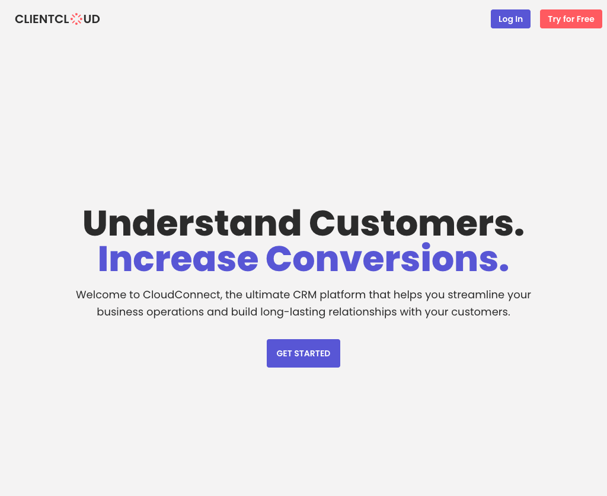

# ClientCloud CRM

ClientCloud is a SaaS product fit for any company looking for their next CRM.

### <a href="https://clientcloud.vercel.app/">Demo</a>

## Tech Stack

**Client:**

- React
- Context API
- Tailwind CSS
- ApexCharts
- DaisyUI
- react-hot-toast
- @tabler/icons-react

## Run Locally

Clone the project

```bash
  git clone https://github.com/trdotpy/rh-furniture
```

Go to the project directory

```bash
  cd rh-furniture
```

Set environment variables

```bash
DATABASE_URL=
PORT=
SECRET=
REACT_APP_API_URL=
```

Install dependencies

```bash
  npm install
```

Start the server

```bash
  npm start
```

## Screenshots


