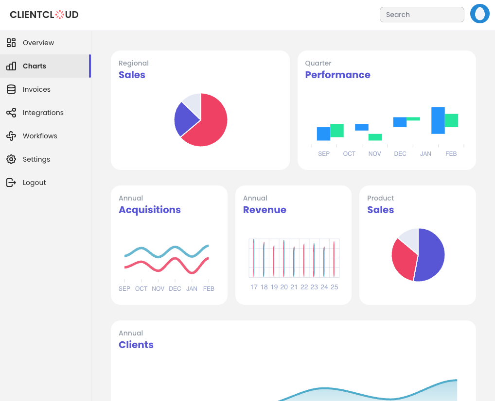
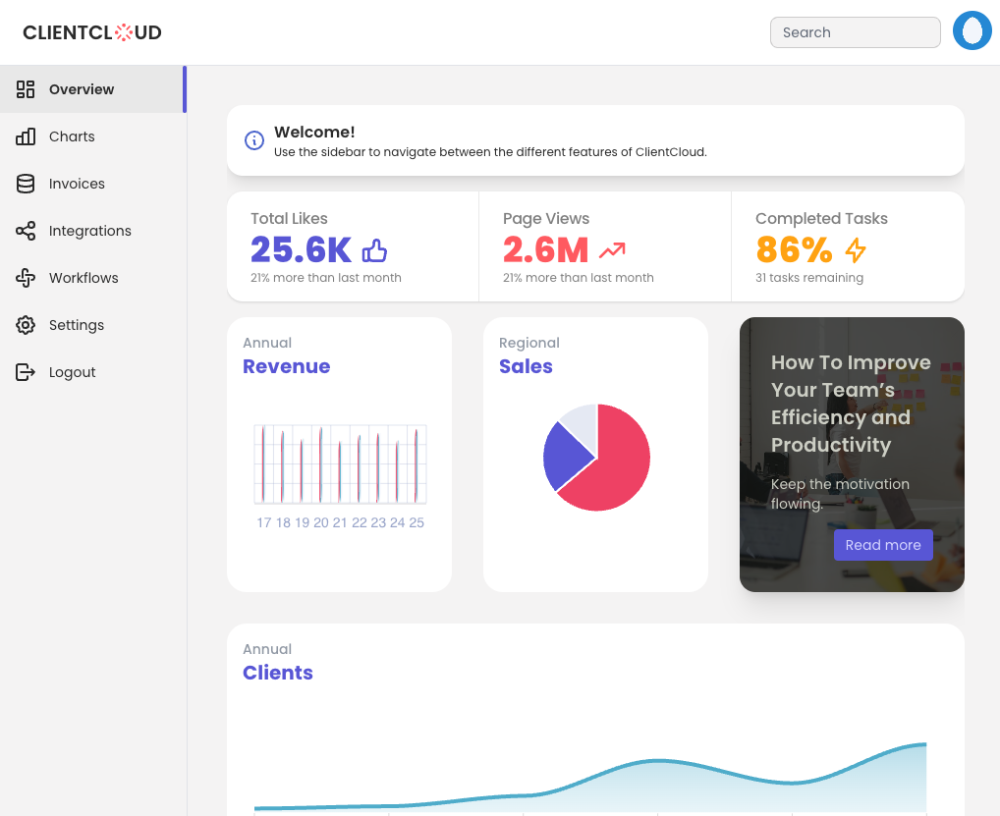
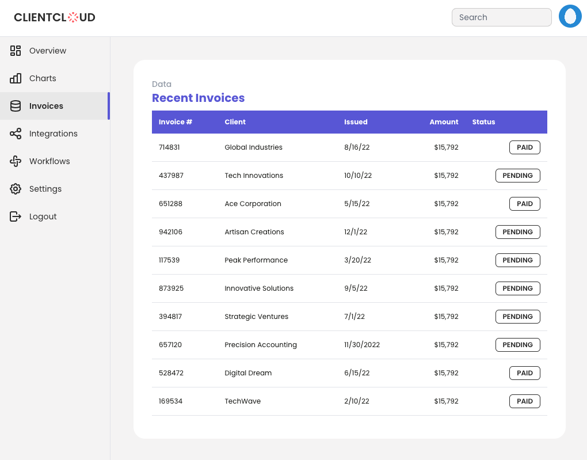
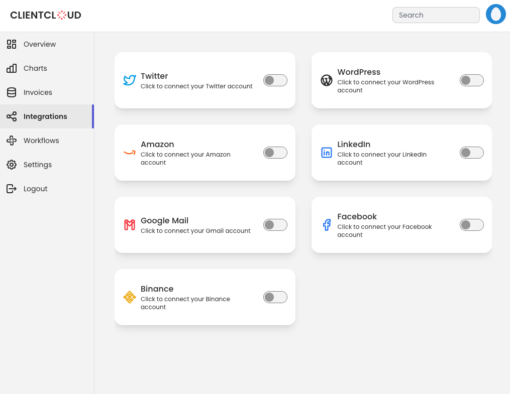

# ClientCloud CRM

ClientCloud is a SaaS product for companies to manage relationships with their customers and track key data insights.

### <a href="https://clientcloud.vercel.app/">Demo</a>

## Tech Stack

**Client:**

- React
- Context API
- Tailwind CSS
- ApexCharts
- DaisyUI
- react-hot-toast
- @tabler/icons-react

## Screenshots






## Run Locally

Clone the project

```bash
  git clone https://github.com/trdotpy/clientcloud
```

Go to the project directory

```bash
  cd clientcloud
```

Install dependencies

```bash
  npm install
```

Start the server

```bash
  npm start
```

## Contact

<a href="https://trdotpy.dev/">
  
</a>
<a href="https://www.linkedin.com/in/trdotpy/">
  
</a>
<a href="mailto:tanvi.rahman@outlook.com">
  
</a>
</div>

## License

[MIT](https://choosealicense.com/licenses/mit/)
